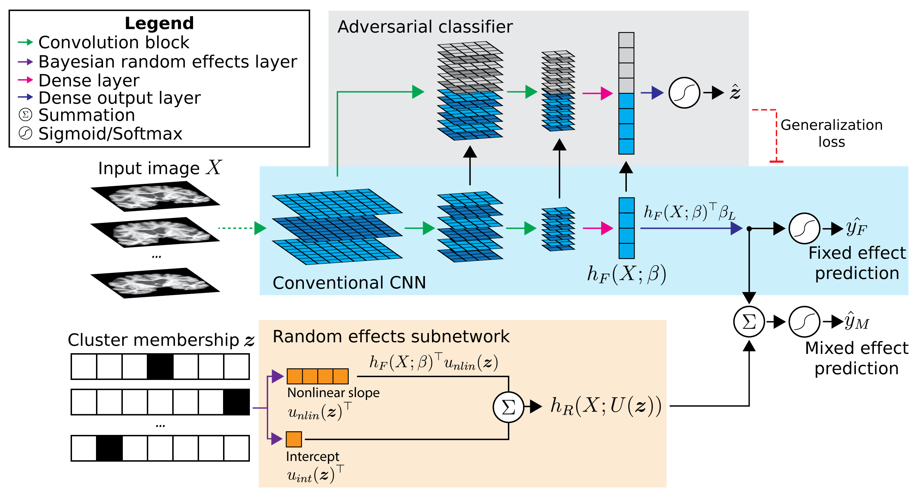

# Alzheimer's Disease diagnosis from T1-weighted MRI

## Data preprocessing

1. Image selection: `select_images_dx.ipynb` performs some dataset curation and selects good-quality images from the ADNI2 and ADNI3 datasets. It generates a .csv file containing image information and an sMRI_input_files.csv file for use with the DLLabPipeline.

2. Preprocessing pipeline: Run DLLabPipeline using the config_ADNI23_sMRI.ini and the previously generated sMRI_input_files.csv. 

3. Get cross-hippocampal coronal slices: `preproc_extract_hippo_slices.py` extracts a coronal slice through the right hippocampus from each preprocessed image. The slices are saved as .png files.

4. Partition data into train/validation/test/heldout sites: `png_to_numpy_data_splits.py` selects a number of sites to include for further analyses. Monte Carlo random splitting is used to generate train/validation/test partitions and save as .npz Numpy files. Data from the remaining, heldout sites is reserved for evaluating model generalization performance to sites unseen during training. 

## Models
`main.py` is the main script for training and evaluating models. It should be run from the command line, passing in arguments for the selected model type and data path. For example:
```
python main.py --model_type mixedeffects --data_dir /path/to/data/splits
```
See `python main.py --help` for arguments. 

Use `gradcam_comparison.ipynb` to generate GradCAM feature visualization figures. 

`infer_z_unseen_sites.py` trains a basic CNN to predict an image's cluster membership. This is used to infer the cluster membership design matrix Z for each unseen site, allowing the ME-CNN to apply its learned random effects to this data. 

## Model details


