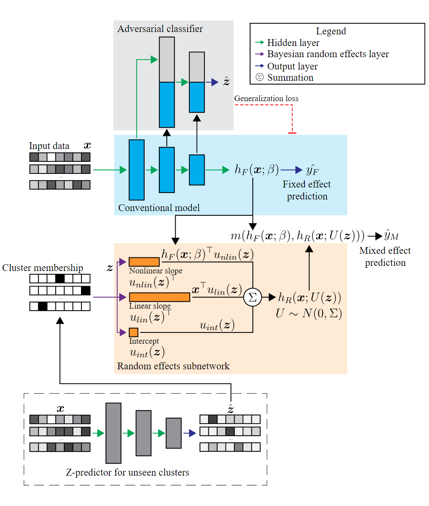

.. ARMED documentation master file, created by
   sphinx-quickstart on Sun Jul  9 18:06:07 2023.
   You can adapt this file completely to your liking, but it should at least
   contain the root `toctree` directive.

Adversarially-regularized mixed effects deep learning (ARMED)
=============================================================
A framework for building mixed effects neural networks for clustered and non-iid
data, as reported in our paper:

K.P. Nguyen, A. H. Treacher and A. A. Montillo, "Adversarially-Regularized Mixed
Effects Deep Learning (ARMED) Models Improve Interpretability, Performance, and
Generalization on Clustered (non-iid) Data," in IEEE Transactions on Pattern
Analysis and Machine Intelligence, vol. 45, no. 7, pp. 8081-8093, 1 July 2023,
doi: `10.1109/TPAMI.2023.3234291 <https://ieeexplore.ieee.org/document/10016237>`_

.. toctree::
   :maxdepth: 2
   :caption: Contents:

   setup
   api
   applications
   license

Indices
=======

* :ref:`genindex`
* :ref:`modindex`
